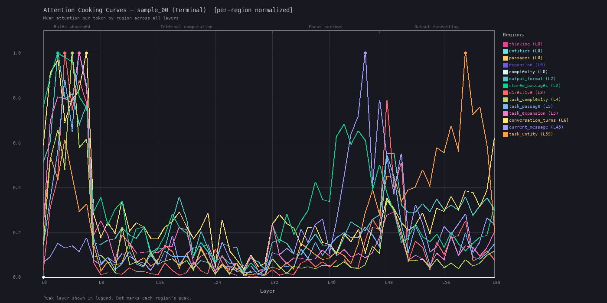
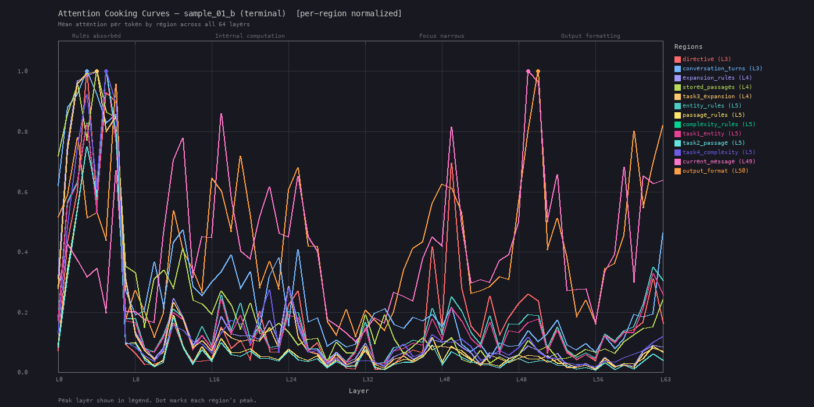

# prompt-mechinterp

Mechanistic interpretability toolkit for analyzing how any LLM processes any prompt. Captures per-token attention weights and logit lens projections across all layers, then renders the results as heatmaps, cooking curves, animated GIFs, and aggregate statistics.

## What it does

- **Attention capture**: Hooks every attention layer to extract head-averaged attention weights at configurable query positions
- **Logit lens**: Projects the residual stream through the final norm + LM head at each layer to track token rank trajectories
- **Region-based analysis**: Maps named regions (defined via JSON config) onto the token sequence, enabling per-region attention metrics
- **Visualization**: Four complementary renderers for different analytical questions
- **Variant comparison**: Automated N-variant comparison with delta tables, multi-seed stability analysis, and markdown reports

## Pipeline

```
prep/inputs.py (local)
    system_prompt.txt + regions.json + conversations.json
    --> test_cases.json (char-level region annotations)

engine/run_analysis.py (GPU box, self-contained)
    test_cases.json + any HuggingFace model
    --> per-case JSON (attention data + logit lens + per-token weights)

render/*.py + analysis/*.py (local)
    per-case JSONs --> PNGs, GIFs, comparison tables, markdown reports
```

## Quick start

```bash
# Install (local — rendering and analysis only)
pip install -e .

# Install with GPU dependencies (for running the engine)
pip install -e ".[gpu]"
```

### 1. Define regions

Create a `regions.json` describing named spans in your prompt:

```json
{
  "system_prompt": {
    "regions": [
      {"name": "rules", "start_marker": "## Rules", "end_marker": "## Examples"},
      {"name": "examples", "start_marker": "## Examples", "end_marker": null}
    ]
  },
  "user_message": {
    "regions": [
      {"name": "context", "start_marker": "Previous:", "end_marker": "Current:"},
      {"name": "current", "start_marker": "Current:", "end_marker": null}
    ]
  }
}
```

### 2. Prepare inputs

```bash
python -m prompt_mechinterp.prep.inputs \
    --prompt system_prompt.txt \
    --regions regions.json \
    --conversations conversations.json \
    --output test_cases.json
```

### 3. Run analysis on GPU

```bash
# scp the self-contained engine, setup script, and test cases to your GPU box
scp src/prompt_mechinterp/engine/run_analysis.py gpu:/workspace/
scp infra/vastai_setup.sh gpu:/workspace/
scp test_cases.json gpu:/workspace/

# Bootstrap the GPU box (MODEL_ID is required)
ssh gpu 'MODEL_ID=meta-llama/Llama-3-8B bash /workspace/vastai_setup.sh'

# Run analysis
ssh gpu 'python /workspace/run_analysis.py \
    --input /workspace/test_cases.json \
    --output /workspace/results/ \
    --model-path /workspace/models/Llama-3-8B \
    --tracked-tokens "<" "keyword"'
```

### 4. Render results

```bash
# Per-token attention heatmap
python -m prompt_mechinterp.render.heatmap --result results/case_0.json --mask-chatml

# Per-region attention trajectories across layers
python -m prompt_mechinterp.render.cooking_curves --result results/case_0.json --normalize per-region

# Animated layer sweep
python -m prompt_mechinterp.render.layer_gif --result results/case_0.json --mask-chatml

# Multi-sample aggregate with confidence bands
python -m prompt_mechinterp.render.aggregate --base-dir results/ --variants baseline:Baseline
```

### 5. Compare variants

```bash
python -m prompt_mechinterp.analysis.compare \
    --base-dir results/ \
    --variants baseline:Baseline modified:Modified \
    --ratio context:current_message

python -m prompt_mechinterp.analysis.report \
    --base-dir results/ \
    --experiments baseline:Baseline:results_baseline modified:Modified:results_modified \
    --output-dir reports/
```

## Input formats

The pipeline takes three input files. All content is model-agnostic — use any system prompt, any conversation structure, any region definitions.

### `system_prompt.txt`

Plain text file containing the full system prompt. This is the exact text that will be inserted into the chat template's system role.

### `conversations.json`

Array of conversation objects. Each object represents one test case for MI analysis.

```json
[
  {
    "id": "case_0",
    "user_message": "What's the weather like in Tokyo?",
    "response": "Tokyo is currently experiencing mild temperatures around 18°C."
  },
  {
    "id": "case_1",
    "user_message": "Tell me more about the forecast.",
    "response": "The week ahead shows increasing cloud cover with rain expected Thursday."
  }
]
```

| Field | Required | Description |
|-------|----------|-------------|
| `id` | yes | Unique case identifier (used for output filenames) |
| `user_message` | yes | The user turn to analyze |
| `response` | yes | The assistant response (can be empty string `""` if analyzing pre-response attention) |
| `user_regions` | no | Per-case region defs for user message (overrides global `user_message.regions`) |
| `response_regions` | no | Per-case region defs for response (overrides global `response.regions`) |

Where conversations come from is up to you — export from a chat database, hand-write them, pull from logs, generate synthetically. The pipeline doesn't care about the source, only the format.

### `regions.json`

Defines named text spans to track attention over. Regions are matched against the assembled prompt text at character level, then resolved to token positions.

```json
{
  "system_prompt": {
    "regions": [
      {"name": "rules", "start_marker": "## Rules", "end_marker": "## Examples"},
      {"name": "examples", "start_marker": "## Examples", "end_marker": null}
    ]
  },
  "user_message": {
    "regions": [
      {"name": "context", "start_marker": "Previous:", "end_marker": "Current:"},
      {"name": "current", "start_marker": "Current:", "end_marker": null}
    ]
  },
  "response": {
    "regions": [
      {"name": "answer", "start_pattern": "^\\w", "end_pattern": null}
    ]
  },
  "query_positions": {
    "terminal": "last_token",
    "decision": {"after_text": "Answer:"}
  },
  "tracked_tokens": ["<", "yes", "no"]
}
```

**Region detection strategies** — each region def needs a `name` and one of these boundary strategies:

| Strategy | Fields | Use when |
|----------|--------|----------|
| Marker | `start_marker`, `end_marker` | Boundaries are literal text strings in the prompt |
| Regex | `start_pattern`, `end_pattern` | Boundaries need pattern matching |
| Character range | `start_char`, `end_char` | You know exact character offsets |

Set `end_marker`, `end_pattern`, or `end_char` to `null` to extend to end of text. Regions can also be nested by including a `regions` array inside a region def.

**Query positions** define where in the token sequence to probe attention and logit lens:

| Value | Meaning |
|-------|---------|
| `"last_token"` | Last token of the user message |
| `{"after_text": "..."}` | First non-whitespace token after the specified text in the response |
| `{"at_text": "..."}` | Token at the specified text in the response |

**Tracked tokens** are specific tokens to monitor rank and probability for across all layers in the logit lens output.

## Package structure

```
src/prompt_mechinterp/
    constants.py          # Shared phase definitions, skip regions, display defaults
    engine/
        run_analysis.py   # Self-contained MI engine (scp to GPU boxes)
        model_adapter.py  # Auto-discovers architecture from any HF model
    prep/
        regions.py        # Region annotation from JSON config
        inputs.py         # Assemble test_cases.json
    render/
        _shared.py        # Fonts, colormaps, layout engine, normalization
        loaders.py        # Unified result JSON loading
        heatmap.py        # Per-token spatial attention heatmap (PNG)
        cooking_curves.py # Per-region attention trajectories (PNG)
        layer_gif.py      # Animated per-token heatmap sweep (GIF)
        aggregate.py      # Multi-sample aggregate curves (PNG)
    analysis/
        metrics.py        # Terminal avg, region ratios, density, cooking stats
        formatting.py     # Table output helpers
        compare.py        # N-variant comparison with delta tables
        report.py         # Markdown experiment reports
docs/
    PIPELINE_EXPLAINED.md # How the MI pipeline works mechanically
    PITFALLS.md           # Failure modes and solutions
    KNOWN_GOOD_APPROACHES.md # Empirically validated patterns
infra/
    vastai_setup.sh       # GPU box bootstrap script
```

## Why this exists

This pipeline was originally built to tune the system prompt for [Mira](https://github.com/taylorsatula/mira-OSS), a persistent digital entity with self-directed memory and context window management. The techniques generalize to any prompt and any model.

Prompt engineering is typically done by feel — you tweak wording, reorder sections, adjust emphasis, then eyeball the outputs to see if they "look right." But this approach is subjective and fragile. A change that seems to improve one case might silently degrade others, and you have no way to know without exhaustive manual testing.

This toolkit replaces guesswork with empirical measurement. By capturing exactly how the model distributes attention across every region of your prompt at every layer, you can see with certainty whether a change is helping or harming — and *where* in the model's processing the effect occurs.

### Before and after

The cooking curves below show the same prompt before and after iterative tuning (both per-region normalized to 0–1 for direct comparison).

The "before" curve is from a first-draft prompt. Several regions show artifact peaks at L0 from near-zero values. `current_message` has a narrow, isolated spike around L42–45 but no sustained dominance. `task_entity` unexpectedly takes over the output formatting layers (L56+), and the mid-layers are noisy with no clear phase differentiation:



After several rounds of restructuring guided by the pipeline's output — adjusting region boundaries, reordering task sections, adding structural markers — the curves show clean phase progression. `directive` and `conversation_turns` peak first (L3), rules regions differentiate through the early-mid layers, `current_message` sustains dominance through the focus layers (L40–50), and `output_format` cleanly takes over the final layers. The mid-layer oscillations are structured rather than noisy:



Every change in that tuning process was validated by re-running the pipeline and comparing curves, rather than relying on whether the model's text output "seemed better."

## Model support

The engine auto-discovers model architecture from any HuggingFace decoder-only transformer:
- Reads layer count, head counts, hidden size, vocab size from `model.config`
- Walks the module tree to find attention submodules, LM head, and final norm
- Phase annotations and layer-dependent rendering scale automatically to any layer count

### Verified model families

| Family | Example model | Chat template | Layers | Notes |
|--------|--------------|---------------|--------|-------|
| **Qwen** | Qwen3-32B | ChatML | 64 | Full support |
| **Llama 3** | Llama-3.1-8B-Instruct | Llama 3 format | 32 | Full support |
| **Mistral** | Mistral-7B-Instruct-v0.1 | `[INST]` format | 32 | Full support |
| **Gemma** | Gemma-2-9B-IT | Gemma format | 42 | System role auto-merged into user |
| **GPT (OpenAI)** | gpt-oss-20b | OpenAI format | 24 | Full support (MoE) |

Models without a system role (Gemma) are handled automatically — the engine merges system content into the first user message. Any HuggingFace model with a chat template and eager attention support should work.

Requirements: `attn_implementation="eager"` (flash attention doesn't materialize the attention matrix).

## GPU requirements

Rule of thumb: `model_params * 2 bytes + 5GB headroom` (fp16 weights + attention capture overhead).

| Model | VRAM needed | Recommended GPU |
|-------|-------------|-----------------|
| 8B params | ~21GB | A100 40GB |
| 32B params | ~69GB | H100 80GB |
| 70B params | ~145GB | Won't fit single GPU — use quantization |

See `docs/PITFALLS.md` for memory estimation details and OOM prevention.

## Documentation

- **[Pipeline Explained](docs/PIPELINE_EXPLAINED.md)** — How region annotation, attention hooks, logit lens, and per-token capture work
- **[Pitfalls](docs/PITFALLS.md)** — Failure modes discovered empirically, with root causes and solutions
- **[Known Good Approaches](docs/KNOWN_GOOD_APPROACHES.md)** — Patterns validated across multiple experiments
- **[SKILL.md](SKILL.md)** — Operational reference for running the full MI pipeline
